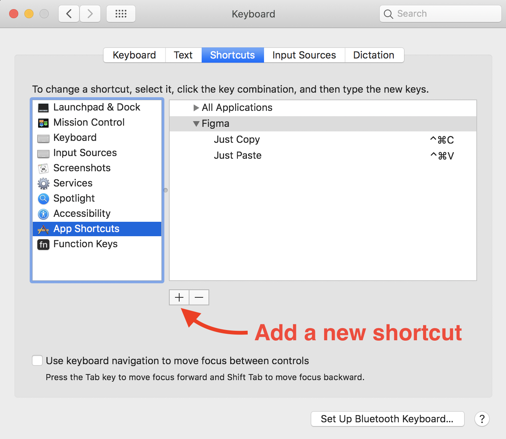

# Just Copy & Paste &mdash; Figma Plugin

This is a Figma plugin that allows to copy layers and paste
them at exactly the same position, no matter what layer was selected.
This is an attempt to implement the default behavior how
copy & paste works in Sketch, Photoshop, Adobe XD and etc.

**Disclaimer:**
There is no way for now to implement some of features to the full because of
some Figma's API limitations. But Figma's team is working on new features and
we will be able to get the plugin work like a charm.

## Usage

Just use this plugin as you usually do when copy & paste layers, but with the
use the plugin's actions "Just Copy" and "Just Paste" from the menu or via
shortcuts.

#### Recommend shortcuts (MacOS)
1. Launch the `System Preferences`, and move to `Keyboard` -> `Shortcuts` -> `App Shortcuts`.
[<br>](img/shortcut-preferences.step1.png)

2. Click the `+` button to add a new shortcut
[<br>](img/shortcut-preferences.step2.png)

3. Set the shortcuts:
    - **Copy**
        1. Application: `Figma`
        2. Menu Title: `Just Copy`
        3. Keyboard Shortcut: `⌃⌘C` (Control + Command + C)
    - **Paste**
        1. Application: `Figma`
        2. Menu Title: `Just Paste`
        3. Keyboard Shortcut: `⌃⌘V` (Control + Command + V)


## Demo

// TODO: add the demo


## Development

#### Installation
```
npm run install
```

#### Watch

Run the watcher that will transpile .ts files into .js files on change
```
npm run watch
```

#### Build

Build for production
```
npm run build
```


## TODO:
- [x] ~~Make list~~
- [ ] The plugin should work with the native Copy/Cut & Paste functions of
Figma (i.e. support clipboard access). Currently Figma doesn't play well with
system shortcut overrides, it works for some shortcuts but not for others.
[They promise to implement that](https://www.figma.com/plugin-docs/whats-supported/#keyboard-shortcuts-for-plugins)


## Contributing
Pull requests are welcome. For major changes, please open an issue first to discuss what you would like to change.


## Credits
The idea initiator - [Filippos Protogeridis](https://github.com/protogeridis)


## License
[MIT](LICENSE)